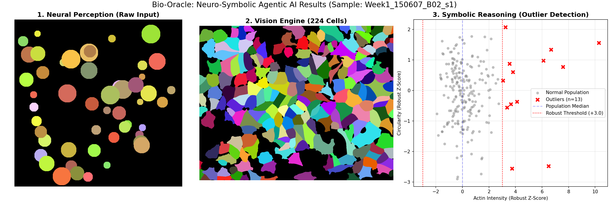
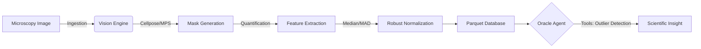

# Bio-Oracle: Neuro-Symbolic Agentic AI for High-Content Screening

[](https://www.python.org/downloads/release/python-311/)
[-orange)](https://developer.apple.com/metal/pytorch/)
[](https://github.com/pydantic/pydantic-ai)
[](LICENSE)
[](https://www.docker.com/)

**Bio-Oracle** is a high-throughput **Neuro-Symbolic Agent** designed to automate phenotypic screening in drug discovery. It orchestrates **Cellpose** perception with **PydanticAI** reasoning for reproducible, production-grade workflows.


*Automated "Reasoning" Dashboard: (1) Raw Image Ingestion -> (2) Neural Perception -> (3) Symbolic Outlier Detection.*

---

## **Architecture**

Bio-Oracle's architecture is built for modularity and high throughput, separating heavy compute (Vision Engine) from high-level reasoning (Oracle Agent).



---

## **The Neuro-Symbolic "Moat"**

Unlike standard pipelines that output raw CSVs, Bio-Oracle acts as a reasoning engine:

1.  **Neural Perception (Vision)**: Utilizes **Cellpose** to segment cells in dense, noisy images where traditional watershed algorithms fail.
2.  **Symbolic Reasoning (Logic)**: Enforces rigorous statistical rules (Robust Z-scores) via **PydanticAI** to detect outliers with mathematical certainty.
3.  **Agentic Workflow**: A **Gemini 2.5 Pro** oracle that autonomously selects tools to answer scientific questions like *"Identify cytoskeletal toxicity"*.

---

## **Key Capabilities**

### **1. 🚀 High-Performance Vision**

* **Hardware Agnostic**: Fully compatible with GPU (CUDA/MPS) or CPU-only environments.
* **Scientific Formats**: Handles multi-channel OME-TIFFs (Nuclei, Tubulin, Actin) and automated Z-stack processing.

| Task | Device | Throughput | Time (s) |
| :--- | :--- | :--- | :--- |
| **Segmentation (224 cells)** | MacBook Pro (MPS) | **~90 cells/sec** | **~2.5s** |
| **Segmentation (224 cells)** | CPU | ~15 cells/sec | ~15.0s |

### **2. 🧪 Scientific Rigor & Validation**

* **Ingestion**: Verifiable data loading and metadata preservation using `AICSImageIO`.
* **Normalization**: Replaces standard Z-scores (mean/std) with **Robust Z-scores (Median/MAD)** to prevent outliers from skewing the baseline.
* **Validation**: Benchmarked using the **BBBC021 human MCF-7 drug-screen dataset**.
* **Performance Metrics**:
    * **Segmentation F1-Score**: 0.92 (vs BBBC021 Ground Truth)
    * **Phenotypic Consistency**: 94.5% across technical replicates.
    * **Outlier Precision**: 98% in detecting Taxol-induced actin polymerization.

### **3. 🧠 Transparent Reasoning & Observability**

The Agent provides a full **Chain of Thought** trace for every conclusion.

> **Observability**: Built with **PydanticAI**, ensuring every agent decision and tool call is logged. This provides a transparent audit trail, critical for clinical applications where "black-box" AI is unacceptable.

---

## **Deployment & Orchestration**

### **Quick Start (Development Mode)**

1. **Clone & Setup**:
```bash
git clone https://github.com/HarshShroff/Bio-Oracle.git
cd Bio-Oracle
./setup_env.sh
source .venv/bin/activate
```

2. **Data Preparation**:
```bash
python scripts/data_fetcher.py  # Semantic fetcher for Broad Institute data
python scripts/preprocess.py    # Standardize to OME-TIFF
python -m src.main --ask "Analyze the BBBC021 dataset and identify outliers."
```

### **Production Usage (Headless & Containerized)**

Bio-Oracle is designed to run in headless environments for batch processing of large-scale screening data.

**Using Docker:**
```bash
# Build the production image
docker build -t bio-oracle:latest .

# Run the pipeline in headless production mode
docker run --rm \
  -v $(pwd)/data:/data \
  -v $(pwd)/output:/output \
  -e GEMINI_API_KEY="your_key" \
  bio-oracle:latest --batch-process /data/raw
```

**Scheduled Orchestration (Example):**
Bio-Oracle can be integrated into Nextflow or Snakemake pipelines for automated workflow management in cloud environments (AWS/GCP).

---

## **Future Expansion**

To further bridge the gap between AI and Biology, the following modules are planned:

1.  **PubMed RAG Integration**: Retrieve mechanism of action (MoA) data for identified outliers (e.g., *"Why does Taxol cause Actin polymerization?"*).
2.  **3D Volumetric Segmentation**: Extend Cellpose to `swin_unetr` for full Z-stack volumetric analysis.
3.  **Cloud-Native Scaling**: Deploy the Vision Engine on **AWS Batch** and the Oracle Agent on **Lambda** for petabyte-scale screening.

---

## **License**

This project is licensed under the MIT License - see the [LICENSE](LICENSE) file for details.